<div align="center">

# 🌟 Ahmed Taha Muhammed 🌟


[](https://git.io/typing-svg)


---

### 🎯 **Quick Connect**

<p align="center">
  <a href="https://my-portfolio-lovat-pi-63.vercel.app/" target="_blank">
    
  </a>
  <a href="mailto:ahmedtahaamuhammed@gmail.com">
    
  </a>
  <a href="https://www.linkedin.com/in/ahmedtahamuhammed" target="_blank">
    
  </a>
  <a href="https://github.com/ahmedtahasubs" target="_blank">
    
  </a>
</p>


---

## 🚀 **About Me**


```typescript
const ahmed = {
  location: "Suez, Egypt 🇪🇬",
  education: "ITI Full Stack .NET Graduate 🎓",
  currentRole: "Full Stack Developer 💻",
  passion: ["Clean Architecture", "Scalable Solutions", "Innovation"],
  lifePhilosophy: "Code with purpose, build with passion! ✨",
  
  dailyRoutine: {
    morning: "☕ Coffee + Planning",
    day: "🔥 Coding + Problem Solving", 
    evening: "📚 Learning + Building",
    night: "🌙 Dreaming in Code"
  },
  
  funFact: "I debug code faster than I debug my life! 😄"
};
```

<div align="left">

### 🎯 **What I'm Up To:**
- 🔭 Currently working on **Enterprise-level .NET Applications**
- 🌱 Learning **Cloud Architecture & DevOps**
- 👯 Looking to collaborate on **Open Source Projects**
- 💬 Ask me about **React, .NET, Clean Architecture**
- ⚡ Fun fact: **I turn coffee into clean code, one component at a time!**

</div>

---

## 🛠️ **Tech Arsenal**


<div align="center">

### **🎨 Frontend Technologies**
<p>
  
</p>

### **⚙️ Backend & Database**
<p>
  
</p>

### **🛠️ Tools & Platforms**
<p>
  
</p>

</div>


---

## 💼 **Professional Experience**


```csharp
public class ProfessionalJourney 
{
    public List<Experience> Career { get; set; } = new()
    {
        new Experience
        {
            Role = "Full Stack .NET Developer",
            Company = "ITI Graduate Program",
            Period = "2024 - Present",
            Technologies = new[] { "ASP.NET Core", "React", "SQL Server", "Entity Framework" },
            Achievements = new[] 
            {
                "Built enterprise-level applications",
                "Mastered clean architecture patterns",
                "Developed responsive web solutions"
            }
        }
    };
    
    public string Motto => "Building tomorrow's solutions today! 🚀";
}
```

---

## 🏆 **Featured Projects**

<div align="center">

### 🛒 **Market Management System**
**Tech Stack:** `ASP.NET Core` `Entity Framework` `SQL Server` `Bootstrap`
- Comprehensive market management solution with inventory tracking
- Role-based authentication and authorization system
- Real-time reporting and analytics dashboard

### 🎨 **Handmade E-commerce Platform**
**Tech Stack:** `React` `Node.js` `MongoDB` `Express`
- Full-stack e-commerce solution for handmade products
- Integrated payment gateway and order management
- Responsive design with modern UI/UX

### 🛍️ **Fresh Cart Shopping App**
**Tech Stack:** `Angular` `TypeScript` `Bootstrap` `REST APIs`
- Dynamic shopping cart with real-time updates
- Product catalog with advanced filtering
- User authentication and profile management

</div>

---

## 📊 **GitHub Analytics**

<div align="center">
  
  
  
</div>

<div align="center">
  
  
</div>

<div align="center">
  
</div>

---

## 🏆 **GitHub Achievements**

<div align="center">
  
</div>

---

## 🎯 **Current Goals for 2025**

```mermaid
graph LR
    A[🎯 2025 Goals] --> B[☁️ Master Cloud Architecture]
    A --> C[📱 Build Mobile Apps]
    A --> D[🤝 Contribute to Open Source]
    A --> E[📚 Share Knowledge]
    
    B --> B1[Azure Certification]
    B --> B2[Microservices]
    
    C --> C1[React Native]
    C --> C2[Flutter]
    
    D --> D1[10+ Contributions]
    D --> D2[Maintain Projects]
    
    E --> E1[Tech Blogs]
    E --> E2[YouTube Videos]
```

<div align="center">



</div>

---

## 🎓 **Education & Certifications**


### **Information Technology Institute (ITI)**
- **Program:** Full Stack .NET Development Track
- **Duration:** 4-Month Intensive Program
- **Focus Areas:** 
  - ASP.NET Core Web Development
  - Database Design & Entity Framework
  - Frontend Technologies (React, Angular)
  - Software Engineering Best Practices

### **Core Competencies**
- 🏗️ **Clean Architecture** - SOLID principles and design patterns
- 🔄 **Full Stack Development** - End-to-end application development
- 🗄️ **Database Design** - Relational database modeling and optimization
- 🎨 **UI/UX Implementation** - Responsive and accessible web interfaces

---

## 💡 **Technical Skills Breakdown**

<div align="center">

| **Category** | **Technologies** | **Proficiency** |
|:---:|:---:|:---:|
| **Backend** | ASP.NET Core, C#, Entity Framework | ⭐⭐⭐⭐⭐ |
| **Frontend** | React, Angular, TypeScript, JavaScript | ⭐⭐⭐⭐⭐ |
| **Database** | SQL Server | ⭐⭐⭐⭐⭐ |
| **Styling** | CSS3, Tailwind CSS, Bootstrap, Material UI | ⭐⭐⭐⭐⭐ |
| **Tools** | Git, Postman, Visual Studio | ⭐⭐⭐⭐⭐ |

</div>

---

## 💬 **Let's Connect & Build Something Amazing!**

<div align="center">


### **📫 How to reach me:**

<p>
  <a href="mailto:ahmedtahaamuhammed@gmail.com">
    
  </a>
  <a href="https://www.linkedin.com/in/ahmedtahamuhammed" target="_blank">
    
  </a>
  <a href="https://my-portfolio-lovat-pi-63.vercel.app/" target="_blank">
    
  </a>
  <a href="https://drive.google.com/file/d/1W3sVBpCXmg0cgN9zMvGNvm_TaYEIHBbk/view?usp=sharing" target="_blank">
    
  </a>
</p>

---

### **🌟 Profile Stats**

<p>
  
  
  
</p>

---

### **💭 Developer Quote**

<div align="center">
  
</div>

---


### **🎉 Thanks for visiting my profile!**

<div align="center">
  
  
  **"Code is like humor. When you have to explain it, it's bad."** - Cory House
  
  
</div>

---

<div align="center">
  <b>⭐ Star some repositories if you find them interesting!</b>
  <br><br>
  
</div>

</div>
